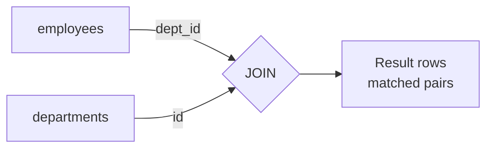
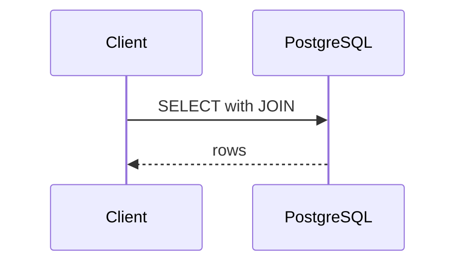
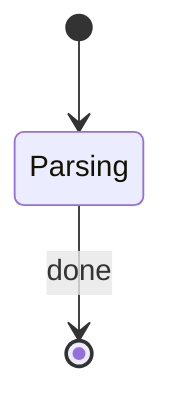



A **JOIN** combines rows from two tables using a related column. Templates like `{{ ds }}` stay literal.

## What is a JOIN?

Some text with `inline code` and a [link](second.html).



*Figure: a join matches rows on a key.*

## Examples

### Example 1: INNER JOIN

```sql
SELECT e.name, d.name AS dept
FROM employees e
JOIN departments d ON e.dept_id = d.id;
```

**Output:**

```output
 name  |  dept
-------+---------
 Asha  | Finance
(1 row)
```

<div class="callout tip" markdown="1">
Use **table aliases** to keep queries short.
</div>

<div class="callout danger" markdown="1">
Filtering the right table in `WHERE` turns a LEFT JOIN into an INNER JOIN.
</div>

| Join | Returns |
|------|---------|
| INNER | matched rows |
| LEFT | all left rows |





```java
public class Main {
    public static void main(String[] args) {
        System.out.println("Hello " + 42);
    }
}
```

## Interview questions

<details markdown="1">
<summary>What is the difference between WHERE and ON in a LEFT JOIN?</summary>

`ON` decides matching; `WHERE` filters the final result.

</details>

## Key takeaways

- One
- Two


